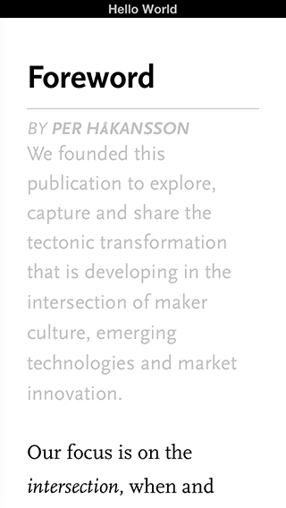
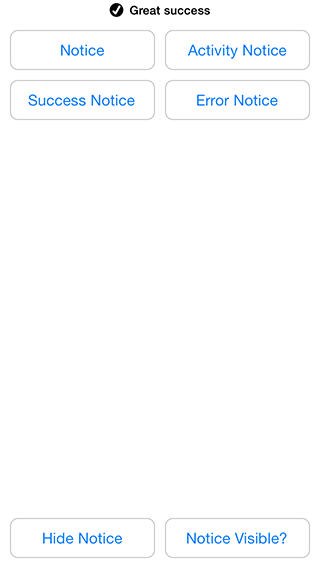
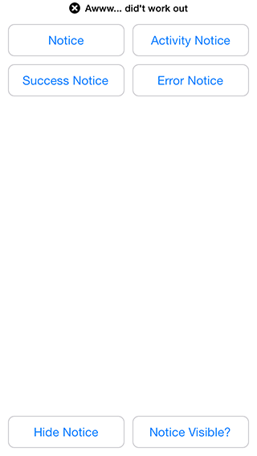

# StatusBar

##Description

A utility class for displaying status updates in the iOS status bar. Inspired by Mailbox and designed to function similar to SVProgressHUD.

## Installation

Add StatusBar to your Gemfile, and run `bundle install`:
```ruby

gem 'StatusBar'
```

If you're making an iOS 7 app, this is a good idea as well:

```ruby

Motion::Project::App.setup do |app|
  # Setting the statusbarstyle to a light style in all the viewcontrollers
  app.info_plist['UIViewControllerBasedStatusBarAppearance'] = false
  app.info_plist['UIStatusBarStyle'] = "UIStatusBarStyleDefault"
end
```
## Usage

``` ruby

# Initilize the status bar
statusbar = Statusbar.new

# And if you want a slide up/down effect instead of rotation when the device rotates
statusbar = Statusbar.new("slide")

# Show a notice... and hide it
statusbar.show_notice("Hello World")
statusbar.hide_notice

# Show notice with an indicator
statusbar.show_activity_notice("Somethings is happening")
statusbar.show_success_notice("Great success")
statusbar.show_error_notice("Awww... did't work out")

# Check if the status bar is currently visible
statusbar.visible?
```

## Demo Project

* [StatusBarDemo](https://github.com/holgersindbaek/StatusBarDemo)

##Screenshots






## Contributing

1. Fork it
2. Create your feature branch (`git checkout -b my-new-feature`)
3. Commit your changes (`git commit -am 'Add some feature'`)
4. Push to the branch (`git push origin my-new-feature`)
5. Create new Pull Request

## Thanks

* [Brian Partridge](https://github.com/brianpartridge) for [BPStatusBar](https://github.com/brianpartridge/BPStatusBar)